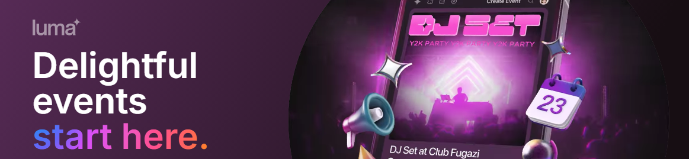

# LUMA

From beautiful event pages to effortless invites and ticketing, Luma is all you need to host a memorable event.



## Inspiration

This project was inspired by the [LUMA](https://www.luma.co.uk/) event management platform.

## Technologies

- [Parcel](https://parceljs.org/)
- [Sass](https://sass-lang.com/)
- [HTML](https://developer.mozilla.org/en-US/docs/Web/HTML)
- [CSS](https://developer.mozilla.org/en-US/docs/Web/CSS)
- [JavaScript](https://developer.mozilla.org/en-US/docs/Web/JavaScript)

## Getting Started

### Prerequisites

- Node.js
- PNPM

### Installing

```bash
npm install
```

### Running

```bash
npm run dev
```

## Contributing

Contributions are welcome! Please open an issue or submit a pull request.
